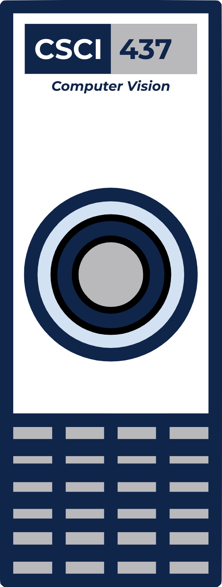

<h1 align="center">CSCI437 Labs - Fall 2020</h1>

  

## Dates

- Created: 8-28-2020
- Concluded: 12-14-2020

## About

- The following is a collection of all 10 labs done for the School of Mine's CSCI437, Intro To Computer Vision, class during the Fall 2020 semester year.
- These labs were a great for helping us learn Python OpenCV, so these labs will be refered back to in the future if need be.
- This repo will stay private, due to this code is technology owned by the Colorado School of Mines.

## [CSCI437](https://www.coursicle.com/mines/courses/CSCI/437/)

### Description

(I) Computer vision is the process of using computers to acquire images, transform images, and extract symbolic descriptions from images. This course provides an introduction to this field, covering topics in image formation, feature extraction, location estimation, and object recognition. Design ability and hands-on projects will be emphasized, using popular software tools. The course will be of interest both to those who want to learn more about the subject and to those who just want to use computer imaging techniques. Must be Senior level standing. 3 hours lecture; 3 semester hours. Prerequisite: (MATH201 or MATH334 or EENG311),and,MATH332,and,(CSCI200 or CSCI261).

### Professors

William Hoff & Tom Williams

### Semester

Fall 2020

## Credit

- There are Python scripts and/or segments of code that was provided by the CSCI437 class during lecture, in slides, or though Canvas. The CSCI437 class is provided at the Colorado School of Mines.
- These labs were done with the following partners:
	- Jean Duong
	- Mehmet Yilmaz

